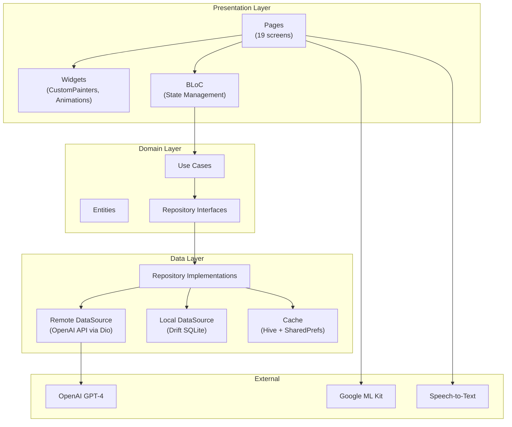
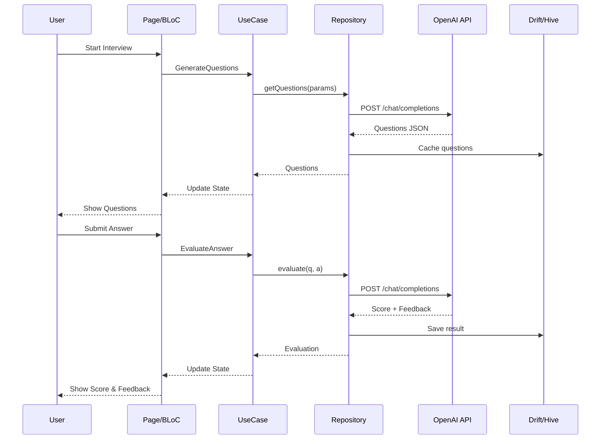

# InterviewAce — AI Interview Coach

**Channuttee Aupayokin** | Student ID: **6614110001**


> **AI-powered interview preparation app** that combines OpenAI GPT-4, Google ML Kit face detection, Speech-to-Text, and gamification to help you ace any interview.

---

## Features Overview

### AI-Powered
| Feature | Description |
|---|---|
| **AI Chat Coach** | Real-time conversational coaching with GPT-4 |
| **AI Question Generation** | Dynamic questions based on role, level, and type |
| **AI Answer Evaluation** | Score + feedback + ideal answer for every response |
| **Voice Interview** | Speech-to-Text to AI evaluation pipeline |
| **Readiness Score** | AI-calculated interview readiness from all data |
| **Skill Gap Analysis** | Identifies weaknesses + recommends resources |
| **AI Tips of the Day** | 14 rotating daily interview tips |

### ML Kit Integration
| Feature | Description |
|---|---|
| **Face Detection** | Real-time confidence tracking via face analysis |
| **Resume OCR Scanner** | Scan physical resumes with text recognition |
| **Video Interview Sim** | Combined face + voice + AI evaluation |

### Gamification
| Feature | Description |
|---|---|
| **XP & Levels** | 10 levels from Beginner to Interview God |
| **Daily Streaks** | Track consecutive practice days |
| **11 Achievement Badges** | Unlock badges for milestones |
| **Practice Calendar** | GitHub-style contribution graph |
| **Leaderboard** | Podium ranking with XP scores |
| **Daily Rewards** | XP bonus + streak multiplier |
| **Flip Card Flashcards** | 10 Q&A cards with 3D flip animation |

### Premium UI/UX
| Feature | Description |
|---|---|
| **Particle Background** | Floating orb glassmorphism effect |
| **Liquid Onboarding** | 4-page animated onboarding flow |
| **Animated Splash** | Elastic logo bounce with expanding rings |
| **Confetti Animation** | 80 particles with gravity physics |
| **Skill Radar Chart** | Multi-axis polygon visualization |
| **Mock Scenarios** | 6 interview types (Panel, Pressure, etc.) |

### Technical
| Feature | Description |
|---|---|
| **Analytics Dashboard** | Score trends, category breakdown, performance |
| **Data Export** | CSV & JSON export functionality |
| **Report Generator** | Formatted interview assessment report |
| **Notifications** | Daily practice reminders |
| **i18n (EN/TH)** | Full bilingual string support |

---

## Architecture

```
Clean Architecture + BLoC Pattern
```



### Data Flow



---

## Project Structure

```
lib/
├── core/
│   ├── constants/       # App colors, theme
│   ├── di/              # GetIt dependency injection
│   ├── l10n/            # i18n strings (EN/TH)
│   ├── router/          # AutoRoute (19 routes)
│   ├── services/        # Notification service
│   └── widgets/         # Shared widgets
│       ├── particle_background.dart
│       ├── skill_radar_chart.dart
│       ├── practice_calendar.dart
│       ├── ai_tip_of_the_day.dart
│       └── confetti_overlay.dart
├── features/
│   ├── analytics/       # Dashboard + charts + export
│   ├── chat/            # AI Coach conversation
│   ├── confidence/      # ML Kit face detection
│   ├── flashcards/      # Flip card Q&A
│   ├── gamification/    # XP, levels, badges, streaks
│   ├── history/         # Session history
│   ├── home/            # Main dashboard
│   ├── interview/       # Core interview flow
│   ├── onboarding/      # Liquid swipe intro
│   ├── readiness/       # Interview readiness score
│   ├── resume_scan/     # OCR resume scanner
│   ├── scenarios/       # Mock interview types
│   ├── settings/        # App preferences
│   ├── skill_gap/       # Skill analysis
│   ├── splash/          # Animated splash screen
│   └── voice/           # Voice interview (STT)
└── main.dart
```

---

## Tech Stack

| Category | Technology |
|---|---|
| **Framework** | Flutter 3.10+ |
| **Language** | Dart 3.0+ |
| **State Management** | flutter_bloc |
| **DI** | get_it |
| **Database** | Drift (SQLite) |
| **Cache** | Hive + SharedPreferences |
| **Networking** | Dio |
| **AI** | OpenAI GPT-4 API |
| **ML** | Google ML Kit (Face + OCR) |
| **Voice** | speech_to_text |
| **Routing** | auto_route |
| **Charts** | fl_chart + Custom Painters |
| **Animation** | flutter_animate + Custom |
| **Fonts** | Google Fonts |

---

## Getting Started

### Prerequisites
- Flutter 3.10+
- Dart 3.0+
- OpenAI API Key

### Setup

```bash
# Clone the repository
git clone https://github.com/TeeChannuttee/Lab-Exam-2---InterviewAce-6614110001.git
cd Lab-Exam-2---InterviewAce-6614110001

# Install dependencies
flutter pub get

# Create .env file with your OpenAI key
echo "OPENAI_API_KEY=your-key-here" > .env
echo "OPENAI_MODEL=gpt-4" >> .env

# Generate code (routes, serialization)
dart run build_runner build --delete-conflicting-outputs

# Run the app
flutter run
```

---

## Testing

```bash
# Run all tests (53 tests)
flutter test

# Unit Tests (BLoC + Mocking with mocktail)
flutter test test/features/history/presentation/bloc/history_bloc_test.dart

# Widget Tests (Form Validation with GlobalKey<FormState>)
flutter test test/features/auth/presentation/pages/login_page_test.dart

# Integration Tests (E2E)
flutter test integration_test/app_test.dart
```

---

## Stats

| Metric | Count |
|---|---|
| **Screens** | 19 |
| **Features** | 35+ |
| **Widgets** | 50+ |
| **Lines of Code** | 8,000+ |
| **Custom Painters** | 6 |
| **Animations** | 15+ |
| **AI Endpoints** | 4 |
| **i18n Strings** | 70+ |
| **Achievement Badges** | 11 |

---

## License

MIT License — free to use for educational purposes.

---

<p align="center">
  Built with Flutter + OpenAI + ML Kit
</p>
